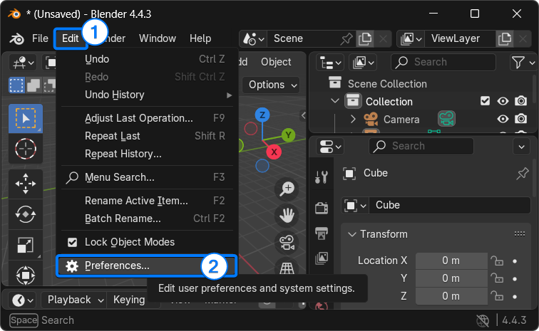
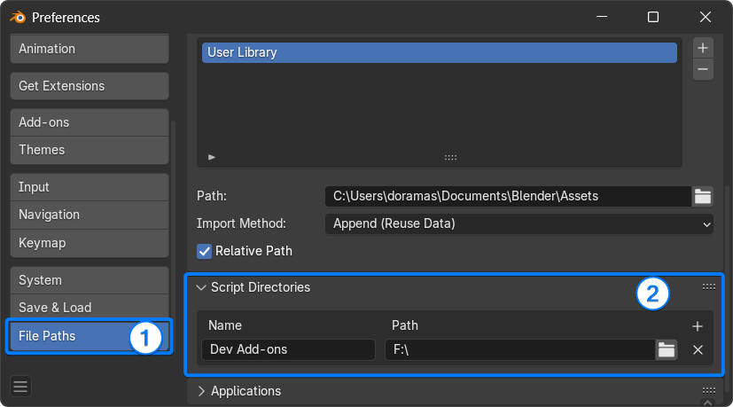
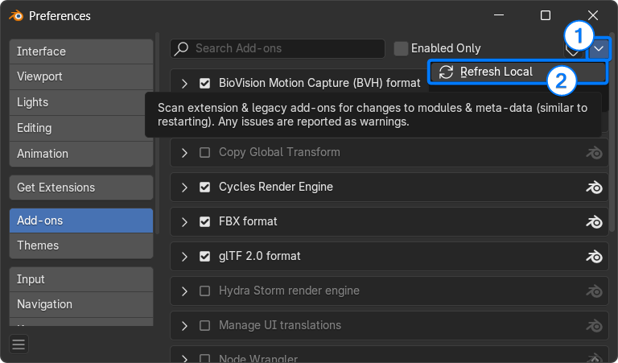

# Blender Add-on template

A structured starting point for developing **Blender** add-ons.

## Development instructions

This guide shows how to set up a custom scripts folder so you can reload your
add-ons without restarting **Blender**.

1. Open **Blender** preferences by pressing `Ctrl` + `,` or going to `Edit` → `Preferences` in the **Blender** menu.

    

2. In the File Paths section, add a custom scripts directory.

    > Make sure there is a directory named 
    `addons` (lowercase) inside the selected folder.

    

3. Save your preferences so the settings persist between **Blender** sessions.

4. Refresh local add-ons. Your add-on should now appear in the list for enabling/disabling.

    > Reload your add-on during development by refreshing local add-ons again with no need to restart Blender.

    

5. Search for your add-on and activate it.

    

## Custom scripts directory structure

Here’s an example of how your custom scripts directory might be organized when adding **Blender** add-ons.

> **Blender** supports both single-file and folder-based add-ons.

<pre>
custom scripts directory/
    └── addons/
        ├── addon.py              # Single-file add-on
        └── addon_folder/         # Folder-based add-on
            ├── __init__.py
            ├── other_module.py
            └── ...
</pre>
